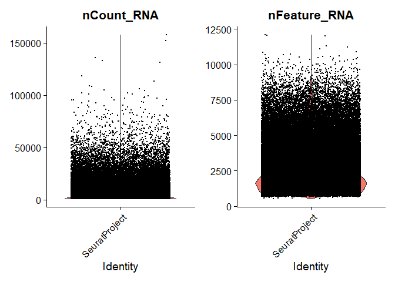
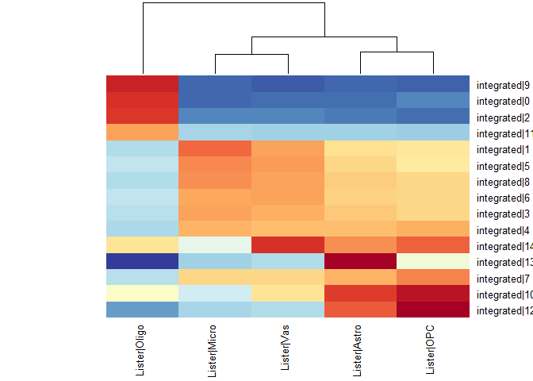
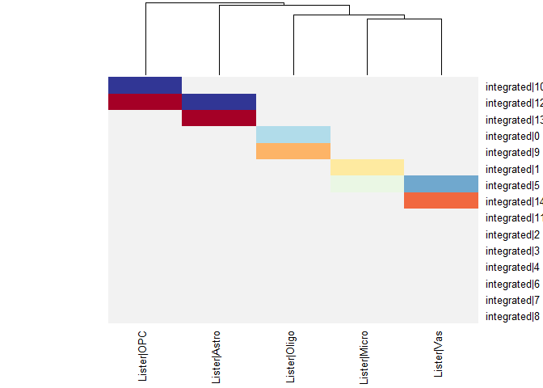
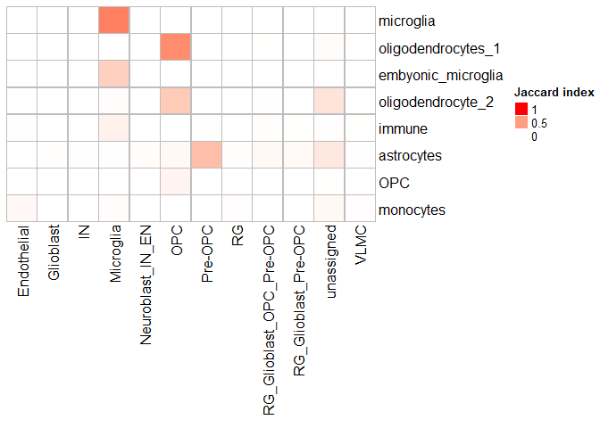
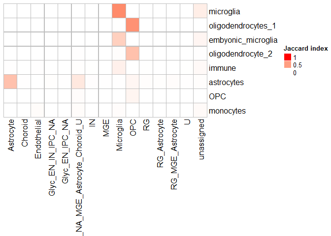

# Single Cell Analysis Workshop book 3

Here we will compare the clusters in our dataset to clusters defined by other researchers in a published datasets. Unlike methods like scClassify, MetaNeighbor does not return a label for each cell, but an overall assessment or the correspondence between pairs of clusters. We will follow this protocol: <https://www.ncbi.nlm.nih.gov/pmc/articles/PMC8826496/> (Procedure 2)

Load required libraries and set base path


```r
Sys.time()  
```

```
## [1] "2023-05-07 15:15:00 EDT"
```

```r
library(tidyverse)
```

```
## ── Attaching packages ─────────────────────────────────────── tidyverse 1.3.2 ──
## ✔ ggplot2 3.4.0      ✔ purrr   1.0.0 
## ✔ tibble  3.1.8      ✔ dplyr   1.0.10
## ✔ tidyr   1.2.1      ✔ stringr 1.5.0 
## ✔ readr   2.1.3      ✔ forcats 0.5.2 
## ── Conflicts ────────────────────────────────────────── tidyverse_conflicts() ──
## ✖ dplyr::filter() masks stats::filter()
## ✖ dplyr::lag()    masks stats::lag()
```

```r
library(Seurat)
```

```
## Attaching SeuratObject
```

```r
library(SingleCellExperiment)
```

```
## Loading required package: SummarizedExperiment
## Loading required package: MatrixGenerics
## Loading required package: matrixStats
## 
## Attaching package: 'matrixStats'
## 
## The following object is masked from 'package:dplyr':
## 
##     count
## 
## 
## Attaching package: 'MatrixGenerics'
## 
## The following objects are masked from 'package:matrixStats':
## 
##     colAlls, colAnyNAs, colAnys, colAvgsPerRowSet, colCollapse,
##     colCounts, colCummaxs, colCummins, colCumprods, colCumsums,
##     colDiffs, colIQRDiffs, colIQRs, colLogSumExps, colMadDiffs,
##     colMads, colMaxs, colMeans2, colMedians, colMins, colOrderStats,
##     colProds, colQuantiles, colRanges, colRanks, colSdDiffs, colSds,
##     colSums2, colTabulates, colVarDiffs, colVars, colWeightedMads,
##     colWeightedMeans, colWeightedMedians, colWeightedSds,
##     colWeightedVars, rowAlls, rowAnyNAs, rowAnys, rowAvgsPerColSet,
##     rowCollapse, rowCounts, rowCummaxs, rowCummins, rowCumprods,
##     rowCumsums, rowDiffs, rowIQRDiffs, rowIQRs, rowLogSumExps,
##     rowMadDiffs, rowMads, rowMaxs, rowMeans2, rowMedians, rowMins,
##     rowOrderStats, rowProds, rowQuantiles, rowRanges, rowRanks,
##     rowSdDiffs, rowSds, rowSums2, rowTabulates, rowVarDiffs, rowVars,
##     rowWeightedMads, rowWeightedMeans, rowWeightedMedians,
##     rowWeightedSds, rowWeightedVars
## 
## Loading required package: GenomicRanges
## Loading required package: stats4
## Loading required package: BiocGenerics
## 
## Attaching package: 'BiocGenerics'
## 
## The following objects are masked from 'package:dplyr':
## 
##     combine, intersect, setdiff, union
## 
## The following objects are masked from 'package:stats':
## 
##     IQR, mad, sd, var, xtabs
## 
## The following objects are masked from 'package:base':
## 
##     anyDuplicated, aperm, append, as.data.frame, basename, cbind,
##     colnames, dirname, do.call, duplicated, eval, evalq, Filter, Find,
##     get, grep, grepl, intersect, is.unsorted, lapply, Map, mapply,
##     match, mget, order, paste, pmax, pmax.int, pmin, pmin.int,
##     Position, rank, rbind, Reduce, rownames, sapply, setdiff, sort,
##     table, tapply, union, unique, unsplit, which.max, which.min
## 
## Loading required package: S4Vectors
## 
## Attaching package: 'S4Vectors'
## 
## The following objects are masked from 'package:dplyr':
## 
##     first, rename
## 
## The following object is masked from 'package:tidyr':
## 
##     expand
## 
## The following objects are masked from 'package:base':
## 
##     expand.grid, I, unname
## 
## Loading required package: IRanges
## 
## Attaching package: 'IRanges'
## 
## The following objects are masked from 'package:dplyr':
## 
##     collapse, desc, slice
## 
## The following object is masked from 'package:purrr':
## 
##     reduce
## 
## The following object is masked from 'package:grDevices':
## 
##     windows
## 
## Loading required package: GenomeInfoDb
## Loading required package: Biobase
## Welcome to Bioconductor
## 
##     Vignettes contain introductory material; view with
##     'browseVignettes()'. To cite Bioconductor, see
##     'citation("Biobase")', and for packages 'citation("pkgname")'.
## 
## 
## Attaching package: 'Biobase'
## 
## The following object is masked from 'package:MatrixGenerics':
## 
##     rowMedians
## 
## The following objects are masked from 'package:matrixStats':
## 
##     anyMissing, rowMedians
## 
## 
## Attaching package: 'SummarizedExperiment'
## 
## The following object is masked from 'package:SeuratObject':
## 
##     Assays
## 
## The following object is masked from 'package:Seurat':
## 
##     Assays
```

```r
library(MetaNeighbor)
library(anndata)
```

```
## Warning: package 'anndata' was built under R version 4.2.3
```

```
## 
## Attaching package: 'anndata'
## 
## The following object is masked from 'package:readr':
## 
##     read_csv
```

```r
library(SeuratDisk)
```

```
## Registered S3 method overwritten by 'SeuratDisk':
##   method            from  
##   as.sparse.H5Group Seurat
```

```r
library(Matrix)
```

```
## 
## Attaching package: 'Matrix'
## 
## The following object is masked from 'package:S4Vectors':
## 
##     expand
## 
## The following objects are masked from 'package:tidyr':
## 
##     expand, pack, unpack
```

```r
library(scclusteval)
library(mclust)
```

```
## Warning: package 'mclust' was built under R version 4.2.3
```

```
## Package 'mclust' version 6.0.0
## Type 'citation("mclust")' for citing this R package in publications.
## 
## Attaching package: 'mclust'
## 
## The following object is masked from 'package:purrr':
## 
##     map
```

```r
setwd("C:/Users/Home/Documents/GitHub/SingleCell_Workshop/")
```

Read in and properly format the data for the Lister lab. This is an example of using data in h5ad format with Seurat.


```r
#Load as anndata, and look at the object
lister_data <- read_h5ad("data/ListerLab/Processed_data_RNA-all_full-counts-and-downsampled-CPM.h5ad")
lister_data
```

```
## AnnData object with n_obs × n_vars = 154748 × 26747
##     obs: 'batch', 'RL#', 'age', 'chem', 'concat_id', 'numerical_age', 'stage_id', 'Sex', 'Race', 'PMI', 'Brain Regions*', 'Cause of Death', 'ICD-10 Code', 'ICD-10 category', 'Oxygen/No Oxygen', 'Date-of-Collection', 'Collection_year', 'Library Prep Date', 'Library Prep Lot', 'n_genes_by_counts', 'log1p_n_genes_by_counts', 'total_counts', 'log1p_total_counts', 'doublet_score', 'log10_gene_counts', 'log10_UMI_counts', 'percent_mito', 'percent_ribo', 'n_counts', 'leiden', 'mat/dev', 'cell_type', 'major_clust', 'sub_clust', 'combined-leiden', 'Astro_GFAP_dev-traj', 'Astro_SLC1A2_dev-traj', 'L2_CUX2_LAMP5_dev-traj', 'L3_CUX2_PRSS12_dev-traj', 'L4_RORB_LRRK1_dev-traj', 'L4_RORB_MET_dev-traj', 'L4_RORB_MME_dev-traj', 'L5-6_THEMIS_CNR1_dev-traj', 'L5-6_THEMIS_NTNG2_dev-traj', 'L5-6_TLE4_HTR2C_dev-traj', 'L5-6_TLE4_SCUBE1_dev-traj', 'L5-6_TLE4_SORCS1_dev-traj', 'Micro_dev-traj', 'OPC_dev-traj', 'OPC_MBP_dev-traj', 'Oligo_dev-traj', 'Vas_CLDN5_dev-traj', 'Vas_PDGFRB_dev-traj', 'Vas_TBX18_dev-traj', 'CCK_RELN_dev-traj', 'CCK_SORCS1_dev-traj', 'CCK_SYT6_dev-traj', 'ID2_CSMD1_dev-traj', 'LAMP5_CCK_dev-traj', 'LAMP5_NDNF_dev-traj', 'LAMP5_NOS1_dev-traj', 'PV_SCUBE3_dev-traj', 'PV_SST_dev-traj', 'PV_SULF1_dev-traj', 'PV_WFDC2_dev-traj', 'SST_ADGRG6_dev-traj', 'SST_B3GAT2_dev-traj', 'SST_BRINP3_dev-traj', 'SST_CALB1_dev-traj', 'SST_NPY_dev-traj', 'SST_STK32A_dev-traj', 'SST_TH_dev-traj', 'VIP_ABI3BP_dev-traj', 'VIP_ADAMTSL1_dev-traj', 'VIP_CHRM2_dev-traj', 'VIP_CRH_dev-traj', 'VIP_DPP6_dev-traj', 'VIP_HS3ST3A1_dev-traj', 'VIP_KIRREL3_dev-traj', 'VIP_PCDH20_dev-traj', 'mj_dev_traj_L4_RORB', 'mj_dev_traj_L2-3_CUX2', 'mj_dev_traj_SST', 'mj_dev_traj_Astro', 'mj_dev_traj_L5-6_TLE4', 'mj_dev_traj_L5-6_THEMIS', 'mj_dev_traj_VIP', 'mj_dev_traj_OPC', 'mj_dev_traj_PV', 'mj_dev_traj_PV_SCUBE3', 'mj_dev_traj_ID2', 'mj_dev_traj_Oligo', 'mj_dev_traj_LAMP5_NOS1', 'mj_dev_traj_Micro', 'mj_dev_traj_Vas', 'mj_dev_traj_Poor-Quality'
##     var: 'gene_ids', 'feature_types', 'non-unique_names', 'n_cells_by_counts', 'mean_counts', 'log1p_mean_counts', 'pct_dropout_by_counts', 'total_counts', 'log1p_total_counts', 'n_counts', 'n_cells', 'highly_variable', 'means', 'dispersions', 'dispersions_norm'
##     uns: 'Astro_GFAP_dev-traj_colors', 'Astro_SLC1A2_dev-traj_colors', 'CCK_RELN_dev-traj_colors', 'CCK_SORCS1_dev-traj_colors', 'CCK_SYT6_dev-traj_colors', 'ID2_CSMD1_dev-traj_colors', 'L2_CUX2_LAMP5_dev-traj_colors', 'L3_CUX2_PRSS12_dev-traj_colors', 'L4_RORB_LRRK1_dev-traj_colors', 'L4_RORB_MET_dev-traj_colors', 'L4_RORB_MME_dev-traj_colors', 'L5-6_THEMIS_CNR1_dev-traj_colors', 'L5-6_THEMIS_NTNG2_dev-traj_colors', 'L5-6_TLE4_HTR2C_dev-traj_colors', 'L5-6_TLE4_SCUBE1_dev-traj_colors', 'L5-6_TLE4_SORCS1_dev-traj_colors', 'LAMP5_CCK_dev-traj_colors', 'LAMP5_NDNF_dev-traj_colors', 'LAMP5_NOS1_dev-traj_colors', 'Micro_dev-traj_colors', 'OPC_MBP_dev-traj_colors', 'OPC_dev-traj_colors', 'Oligo_dev-traj_colors', 'PV_SCUBE3_dev-traj_colors', 'PV_SST_dev-traj_colors', 'PV_SULF1_dev-traj_colors', 'PV_WFDC2_dev-traj_colors', 'SST_ADGRG6_dev-traj_colors', 'SST_B3GAT2_dev-traj_colors', 'SST_BRINP3_dev-traj_colors', 'SST_CALB1_dev-traj_colors', 'SST_NPY_dev-traj_colors', 'SST_STK32A_dev-traj_colors', 'SST_TH_dev-traj_colors', 'VIP_ABI3BP_dev-traj_colors', 'VIP_ADAMTSL1_dev-traj_colors', 'VIP_CHRM2_dev-traj_colors', 'VIP_CRH_dev-traj_colors', 'VIP_DPP6_dev-traj_colors', 'VIP_HS3ST3A1_dev-traj_colors', 'VIP_KIRREL3_dev-traj_colors', 'VIP_PCDH20_dev-traj_colors', 'Vas_CLDN5_dev-traj_colors', 'Vas_PDGFRB_dev-traj_colors', 'Vas_TBX18_dev-traj_colors', 'age_order', 'batch_colors', 'batch_colors_dict', 'batch_order', 'cell_type_colors', 'combined-leiden_colors', 'gaba_clust_data', 'hvg', 'major_clust_colors', 'major_clust_colors_dict', 'major_clust_plot_order', 'mj_dev_traj_Astro_colors', 'mj_dev_traj_ID2_colors', 'mj_dev_traj_L2-3_CUX2_colors', 'mj_dev_traj_L4_RORB_colors', 'mj_dev_traj_L5-6_THEMIS_colors', 'mj_dev_traj_L5-6_TLE4_colors', 'mj_dev_traj_LAMP5_NOS1_colors', 'mj_dev_traj_Micro_colors', 'mj_dev_traj_OPC_colors', 'mj_dev_traj_Oligo_colors', 'mj_dev_traj_PV_SCUBE3_colors', 'mj_dev_traj_PV_colors', 'mj_dev_traj_Poor-Quality_colors', 'mj_dev_traj_SST_colors', 'mj_dev_traj_VIP_colors', 'mj_dev_traj_Vas_colors', 'stage_colors_dict', 'stage_id_colors', 'stage_order', 'sub_clust_colors', 'wt_clust_data'
##     obsm: 'X_pca', 'X_umap'
##     layers: 'ds_norm_cts'
##     obsp: 'connectivities', 'distances'
```

```r
#Convert the basics to Seurat format, look at the object
lister_data <- CreateSeuratObject(counts = t(lister_data$X), meta.data = lister_data$obs)
```

```
## Warning: Feature names cannot have underscores ('_'), replacing with dashes
## ('-')
```

```
## Warning: Invalid name supplied, making object
## name syntactically valid. New object name is
## batchRL.agechemconcat_idnumerical_agestage_idSexRacePMIBrain.Regions.Cause.of.DeathICD.10.CodeICD.10.categoryOxygen.No.OxygenDate.of.CollectionCollection_yearLibrary.Prep.DateLibrary.Prep.Lotn_genes_by_countslog1p_n_genes_by_countstotal_countslog1p_total_countsdoublet_scorelog10_gene_countslog10_UMI_countspercent_mitopercent_ribon_countsleidenmat.devcell_typemajor_clustsub_clustcombined.leidenAstro_GFAP_dev.trajAstro_SLC1A2_dev.trajL2_CUX2_LAMP5_dev.trajL3_CUX2_PRSS12_dev.trajL4_RORB_LRRK1_dev.trajL4_RORB_MET_dev.trajL4_RORB_MME_dev.trajL5.6_THEMIS_CNR1_dev.trajL5.6_THEMIS_NTNG2_dev.trajL5.6_TLE4_HTR2C_dev.trajL5.6_TLE4_SCUBE1_dev.trajL5.6_TLE4_SORCS1_dev.trajMicro_dev.trajOPC_dev.trajOPC_MBP_dev.trajOligo_dev.trajVas_CLDN5_dev.trajVas_PDGFRB_dev.trajVas_TBX18_dev.trajCCK_RELN_dev.trajCCK_SORCS1_dev.trajCCK_SYT6_dev.trajID2_CSMD1_dev.trajLAMP5_CCK_dev.trajLAMP5_NDNF_dev.trajLAMP5_NOS1_dev.trajPV_SCUBE3_dev.trajPV_SST_dev.trajPV_SULF1_dev.trajPV_WFDC2_dev.trajSST_ADGRG6_dev.trajSST_B3GAT2_dev.trajSST_BRINP3_dev.trajSST_CALB1_dev.trajSST_NPY_dev.trajSST_STK32A_dev.trajSST_TH_dev.trajVIP_ABI3BP_dev.trajVIP_ADAMTSL1_dev.trajVIP_CHRM2_dev.trajVIP_CRH_dev.trajVIP_DPP6_dev.trajVIP_HS3ST3A1_dev.trajVIP_KIRREL3_dev.trajVIP_PCDH20_dev.trajmj_dev_traj_L4_RORBmj_dev_traj_L2.3_CUX2mj_dev_traj_SSTmj_dev_traj_Astromj_dev_traj_L5.6_TLE4mj_dev_traj_L5.6_THEMISmj_dev_traj_VIPmj_dev_traj_OPCmj_dev_traj_PVmj_dev_traj_PV_SCUBE3mj_dev_traj_ID2mj_dev_traj_Oligomj_dev_traj_LAMP5_NOS1mj_dev_traj_Micromj_dev_traj_Vasmj_dev_traj_Poor.Quality;
## see ?make.names for more details on syntax validity
```


```r
lister_data
```

```
## An object of class Seurat 
## 26747 features across 154748 samples within 1 assay 
## Active assay: RNA (26747 features, 0 variable features)
```

```r
#Look at the major cell types and clusters, also distribution of genes and UMIs
lister_data$cell_type %>% table
```

```
## .
##           IN      Non-Neu           PN Poor-Quality 
##        27561        66543        59369         1275
```

```r
lister_data$major_clust %>% table
```

```
## .
##    L2-3_CUX2      L4_RORB  L5-6_THEMIS    L5-6_TLE4       PN_dev          VIP 
##        24316        14668         7713         8845         3827         6868 
##          ID2   LAMP5_NOS1      CGE_dev          SST           PV    PV_SCUBE3 
##         4930          837          988         7491         3848          987 
##      MGE_dev        Astro          OPC        Oligo        Micro          Vas 
##         1612        25053        11145        23450         5672         1223 
## Poor-Quality 
##         1275
```

```r
VlnPlot(lister_data, features = c("nCount_RNA", "nFeature_RNA"), pt.size = 0.001)
```

<!-- -->

```r
lister_data$nCount_RNA %>% summary
```

```
##    Min. 1st Qu.  Median    Mean 3rd Qu.    Max. 
##    1000    2393    4209    6597    7503  157640
```

```r
lister_data$nFeature_RNA %>% summary
```

```
##    Min. 1st Qu.  Median    Mean 3rd Qu.    Max. 
##     518    1483    2186    2583    3216   12091
```

Now we will train some classifiers using this object as the reference, but first we will do some pre-processing. 

First we wiill build the classifier suing all the cells, and then we will re-run the analysis using only the non-neuronal cells. 


```r
#Normalize, find variable features, convert to SingleCellExperiment and subset to only the variable features 
lister_data <- subset(lister_data, cell_type == "Non-Neu")
lister_data <- NormalizeData(lister_data, normalization.method = "LogNormalize", scale.factor = 10000)
lister_data <- FindVariableFeatures(lister_data, selection.method = "vst", nfeatures = 3000)
var_features <- VariableFeatures(lister_data)
lister_data <- as.SingleCellExperiment(lister_data)
lister_data <- lister_data[var_features,]
lister_data
```

```
## class: SingleCellExperiment 
## dim: 3000 66543 
## metadata(0):
## assays(2): counts logcounts
## rownames(3000): ATP1B3 FLT1 ... SLC7A8 RP3-518E13.2
## rowData names(0):
## colnames(66543): AAACCTGCAAGGACTG-RL1612_34d_v2
##   AAACCTGGTTACGCGC-RL1612_34d_v2 ... TTTGTTGCACAAGCTT-RL2132_25yr_v3
##   TTTGTTGGTAAGGTCG-RL2132_25yr_v3
## colData names(100): orig.ident nCount_RNA ... mj_dev_traj_Poor.Quality
##   ident
## reducedDimNames(0):
## mainExpName: RNA
## altExpNames(0):
```

Time to train the model!


```r
pretrained_model_major_cluster = MetaNeighbor::trainModel(
 var_genes = rownames(lister_data),
 dat = lister_data,
 study_id = rep("Lister", dim(lister_data)[2]),
 cell_type = lister_data$major_clust
)
```

```
## Warning in asMethod(object): sparse->dense coercion: allocating vector of size
## 1.5 GiB
```

Remove the Lister lab object, and load our integrated Seurat object


```r
rm(lister_data)
integrated_seurat <- readRDS("integrated_seurat.Rds")
integrated_seurat <- as.SingleCellExperiment(integrated_seurat)
```

Classify using the major clusters and plot results


```r
#One versus all
aurocs = MetaNeighborUS(
 trained_model = pretrained_model_major_cluster, dat = integrated_seurat,
 study_id = rep("integrated", dim(integrated_seurat)[2]), 
 cell_type = integrated_seurat$integrated_snn_res.1.5,
 fast_version = TRUE
)
tryCatch({plotHeatmapPretrained(aurocs, margins = c(5,5))}, error = function(error_condition) {})
```

<!-- -->

```
## NULL
```


```r
#One versus best
best_hits = MetaNeighborUS(
 trained_model = pretrained_model_major_cluster, dat = integrated_seurat,
 study_id = rep("integrated", dim(integrated_seurat)[2]), 
 cell_type = integrated_seurat$integrated_snn_res.1.5,
 one_vs_best = TRUE,
 fast_version = TRUE
)
tryCatch({plotHeatmapPretrained(best_hits, margins = c(5,5))}, 
         error = function(error_condition) {})
```

<!-- -->

```
## NULL
```

Compare labels obtained with supervised classification of cells and unsupervised clustering


```r
 integrated_seurat <- readRDS("integrated_seurat.Rds")
 plot1 <- PairWiseJaccardSetsHeatmap(Idents(integrated_seurat), integrated_seurat$Karolinski)
 adjustedRandIndex(Idents(integrated_seurat), integrated_seurat$Karolinski) %>% print
```

```
## [1] 0.4471718
```

```r
 plot1
```

<!-- -->

```r
 plot2 <- PairWiseJaccardSetsHeatmap(Idents(integrated_seurat), integrated_seurat$Nowakowski)
 adjustedRandIndex(Idents(integrated_seurat), integrated_seurat$Nowakowski) %>% print
```

```
## [1] 0.3989508
```

```r
 plot2
```

<!-- -->


```r
 #pdf(file = "C:/Users/Home/Documents/GitHub/SingleCell_Workshop/JaccardIndexPlots.pdf", onefile = TRUE)
  plot1
```

<!-- -->

```r
  plot2
```

<!-- -->

```r
 #dev.off()
```
Generate counts summed by or averaged by sample and cluster 


```r
Idents(integrated_seurat) <- paste(Idents(integrated_seurat), integrated_seurat$age, sep = ".")
aggregated_seurat <- AggregateExpression(integrated_seurat, assays = "RNA", slot = "counts", group.by = )
aggregated_seurat$RNA %>% head
```

```
##            microglia.14 oligodendrocyte_2.14 immune.14 embyonic_microglia.14
## AL627309.1            4                    2         0                     1
## AL669831.5          134                  102         1                    38
## FAM87B               20                    0         0                     1
## LINC00115           119                    9         0                    27
## FAM41C               62                   17         0                    11
## AL645608.3            4                    0         0                     0
##            oligodendrocytes_1.14 astrocytes.14 OPC.14 monocytes.14 immune.41
## AL627309.1                     6             0      0            0         0
## AL669831.5                   106            12     10            1         0
## FAM87B                         0             0      0            0         0
## LINC00115                     19             0      7            0         0
## FAM41C                        26             3      1            2         1
## AL645608.3                     0             0      2            1         0
##            oligodendrocytes_1.41 microglia.41 oligodendrocyte_2.41
## AL627309.1                     6            0                    3
## AL669831.5                    29           40                   13
## FAM87B                         0            4                    0
## LINC00115                     11           20                    5
## FAM41C                        10           24                    6
## AL645608.3                     2            3                    0
##            embyonic_microglia.41 monocytes.41 OPC.41 astrocytes.41
## AL627309.1                     2            0      0             0
## AL669831.5                    14            2      0             1
## FAM87B                         1            0      0             0
## LINC00115                     14            2      0             0
## FAM41C                        12            0      0             1
## AL645608.3                     2            0      0             0
```

```r
aggregated_seurat$RNA %>% colSums
```

```
##          microglia.14  oligodendrocyte_2.14             immune.14 
##               9921771               5528412                111095 
## embyonic_microglia.14 oligodendrocytes_1.14         astrocytes.14 
##               1790789               6370826                555667 
##                OPC.14          monocytes.14             immune.41 
##                634253                168710                132942 
## oligodendrocytes_1.41          microglia.41  oligodendrocyte_2.41 
##               2421835               2809643               1416351 
## embyonic_microglia.41          monocytes.41                OPC.41 
##                794112                158601                 31990 
##         astrocytes.41 
##                 79893
```

```r
average_seurat <- AverageExpression(integrated_seurat, assays = "RNA", slot = "counts", group.by = )
average_seurat$RNA %>% head
```

```
##            microglia.14 oligodendrocyte_2.14   immune.14 embyonic_microglia.14
## AL627309.1  0.001247272           0.00239521 0.000000000          0.0008710801
## AL669831.5  0.041783598           0.12215569 0.004444444          0.0331010453
## FAM87B      0.006236358           0.00000000 0.000000000          0.0008710801
## LINC00115   0.037106330           0.01077844 0.000000000          0.0235191638
## FAM41C      0.019332710           0.02035928 0.000000000          0.0095818815
## AL645608.3  0.001247272           0.00000000 0.000000000          0.0000000000
##            oligodendrocytes_1.14 astrocytes.14      OPC.14 monocytes.14
## AL627309.1           0.004950495    0.00000000 0.000000000   0.00000000
## AL669831.5           0.087458746    0.04460967 0.064102564   0.02040816
## FAM87B               0.000000000    0.00000000 0.000000000   0.00000000
## LINC00115            0.015676568    0.00000000 0.044871795   0.00000000
## FAM41C               0.021452145    0.01115242 0.006410256   0.04081633
## AL645608.3           0.000000000    0.00000000 0.012820513   0.02040816
##              immune.41 oligodendrocytes_1.41 microglia.41 oligodendrocyte_2.41
## AL627309.1 0.000000000            0.01608579  0.000000000           0.01595745
## AL669831.5 0.000000000            0.07774799  0.061538462           0.06914894
## FAM87B     0.000000000            0.00000000  0.006153846           0.00000000
## LINC00115  0.000000000            0.02949062  0.030769231           0.02659574
## FAM41C     0.004166667            0.02680965  0.036923077           0.03191489
## AL645608.3 0.000000000            0.00536193  0.004615385           0.00000000
##            embyonic_microglia.41 monocytes.41 OPC.41 astrocytes.41
## AL627309.1           0.005747126   0.00000000      0    0.00000000
## AL669831.5           0.040229885   0.03076923      0    0.01333333
## FAM87B               0.002873563   0.00000000      0    0.00000000
## LINC00115            0.040229885   0.03076923      0    0.00000000
## FAM41C               0.034482759   0.00000000      0    0.01333333
## AL645608.3           0.005747126   0.00000000      0    0.00000000
```

```r
average_seurat$RNA %>% colSums
```

```
##          microglia.14  oligodendrocyte_2.14             immune.14 
##             3093.7858             6620.8527              493.7556 
## embyonic_microglia.14 oligodendrocytes_1.14         astrocytes.14 
##             1559.9207             5256.4571             2065.6766 
##                OPC.14          monocytes.14             immune.41 
##             4065.7244             3443.0612              553.9250 
## oligodendrocytes_1.41          microglia.41  oligodendrocyte_2.41 
##             6492.8552             4322.5277             7533.7819 
## embyonic_microglia.41          monocytes.41                OPC.41 
##             2281.9310             2440.0154             7997.5000 
##         astrocytes.41 
##             1065.2400
```

Do some house-keeping


```r
print(summary(warnings()))
```

```
## Length  Class   Mode 
##      0   NULL   NULL
```

```r
sessionInfo()
```

```
## R version 4.2.2 (2022-10-31 ucrt)
## Platform: x86_64-w64-mingw32/x64 (64-bit)
## Running under: Windows 10 x64 (build 19045)
## 
## Matrix products: default
## 
## locale:
## [1] LC_COLLATE=English_Canada.utf8  LC_CTYPE=English_Canada.utf8   
## [3] LC_MONETARY=English_Canada.utf8 LC_NUMERIC=C                   
## [5] LC_TIME=English_Canada.utf8    
## 
## attached base packages:
## [1] stats4    stats     graphics  grDevices utils     datasets  methods  
## [8] base     
## 
## other attached packages:
##  [1] mclust_6.0.0                scclusteval_0.0.0.9000     
##  [3] Matrix_1.5-3                SeuratDisk_0.0.0.9020      
##  [5] anndata_0.7.5.6             MetaNeighbor_1.18.0        
##  [7] SingleCellExperiment_1.20.1 SummarizedExperiment_1.28.0
##  [9] Biobase_2.58.0              GenomicRanges_1.50.2       
## [11] GenomeInfoDb_1.34.9         IRanges_2.32.0             
## [13] S4Vectors_0.36.2            BiocGenerics_0.44.0        
## [15] MatrixGenerics_1.10.0       matrixStats_0.63.0         
## [17] SeuratObject_4.1.3          Seurat_4.3.0               
## [19] forcats_0.5.2               stringr_1.5.0              
## [21] dplyr_1.0.10                purrr_1.0.0                
## [23] readr_2.1.3                 tidyr_1.2.1                
## [25] tibble_3.1.8                ggplot2_3.4.0              
## [27] tidyverse_1.3.2            
## 
## loaded via a namespace (and not attached):
##   [1] utf8_1.2.2             spatstat.explore_3.1-0 reticulate_1.28       
##   [4] tidyselect_1.2.0       htmlwidgets_1.6.1      grid_4.2.2            
##   [7] Rtsne_0.16             munsell_0.5.0          codetools_0.2-18      
##  [10] ica_1.0-3              future_1.32.0          miniUI_0.1.1.1        
##  [13] withr_2.5.0            spatstat.random_3.1-4  colorspace_2.0-3      
##  [16] progressr_0.13.0       highr_0.10             knitr_1.41            
##  [19] rstudioapi_0.14        ROCR_1.0-11            tensor_1.5            
##  [22] listenv_0.9.0          labeling_0.4.2         GenomeInfoDbData_1.2.9
##  [25] polyclip_1.10-4        bit64_4.0.5            farver_2.1.1          
##  [28] rprojroot_2.0.3        parallelly_1.34.0      vctrs_0.5.1           
##  [31] generics_0.1.3         xfun_0.36              timechange_0.1.1      
##  [34] doParallel_1.0.17      R6_2.5.1               clue_0.3-64           
##  [37] hdf5r_1.3.8            bitops_1.0-7           spatstat.utils_3.0-2  
##  [40] cachem_1.0.6           DelayedArray_0.23.2    assertthat_0.2.1      
##  [43] promises_1.2.0.1       scales_1.2.1           googlesheets4_1.0.1   
##  [46] gtable_0.3.1           globals_0.16.2         goftest_1.2-3         
##  [49] rlang_1.0.6            GlobalOptions_0.1.2    splines_4.2.2         
##  [52] lazyeval_0.2.2         gargle_1.2.1           spatstat.geom_3.1-0   
##  [55] broom_1.0.2            yaml_2.3.6             reshape2_1.4.4        
##  [58] abind_1.4-5            modelr_0.1.10          backports_1.4.1       
##  [61] httpuv_1.6.7           tools_4.2.2            ellipsis_0.3.2        
##  [64] gplots_3.1.3           jquerylib_0.1.4        RColorBrewer_1.1-3    
##  [67] ggridges_0.5.4         Rcpp_1.0.9             plyr_1.8.8            
##  [70] zlibbioc_1.44.0        RCurl_1.98-1.10        deldir_1.0-6          
##  [73] GetoptLong_1.0.5       pbapply_1.7-0          cowplot_1.1.1         
##  [76] zoo_1.8-11             haven_2.5.1            ggrepel_0.9.3         
##  [79] cluster_2.1.4          fs_1.5.2               here_1.0.1            
##  [82] magrittr_2.0.3         data.table_1.14.6      scattermore_0.8       
##  [85] circlize_0.4.15        lmtest_0.9-40          reprex_2.0.2          
##  [88] RANN_2.6.1             googledrive_2.0.0      fitdistrplus_1.1-8    
##  [91] hms_1.1.2              patchwork_1.1.2        mime_0.12             
##  [94] evaluate_0.19          xtable_1.8-4           readxl_1.4.1          
##  [97] shape_1.4.6            gridExtra_2.3          compiler_4.2.2        
## [100] KernSmooth_2.23-20     crayon_1.5.2           htmltools_0.5.4       
## [103] later_1.3.0            tzdb_0.3.0             lubridate_1.9.0       
## [106] DBI_1.1.3              ComplexHeatmap_2.14.0  dbplyr_2.2.1          
## [109] MASS_7.3-58.1          cli_3.5.0              parallel_4.2.2        
## [112] igraph_1.3.5           pkgconfig_2.0.3        sp_1.6-0              
## [115] plotly_4.10.1          spatstat.sparse_3.0-1  foreach_1.5.2         
## [118] xml2_1.3.3             bslib_0.4.2            XVector_0.38.0        
## [121] rvest_1.0.3            digest_0.6.31          sctransform_0.3.5     
## [124] RcppAnnoy_0.0.20       spatstat.data_3.0-1    rmarkdown_2.19        
## [127] cellranger_1.1.0       leiden_0.4.3           uwot_0.1.14           
## [130] shiny_1.7.4            gtools_3.9.4           rjson_0.2.21          
## [133] lifecycle_1.0.3        nlme_3.1-160           jsonlite_1.8.4        
## [136] viridisLite_0.4.1      fansi_1.0.3            pillar_1.8.1          
## [139] lattice_0.20-45        fastmap_1.1.0          httr_1.4.4            
## [142] survival_3.4-0         glue_1.6.2             iterators_1.0.14      
## [145] png_0.1-8              bit_4.0.5              stringi_1.7.8         
## [148] sass_0.4.4             caTools_1.18.2         irlba_2.3.5.1         
## [151] future.apply_1.10.0
```

```r
Sys.time()
```

```
## [1] "2023-05-07 15:19:49 EDT"
```
